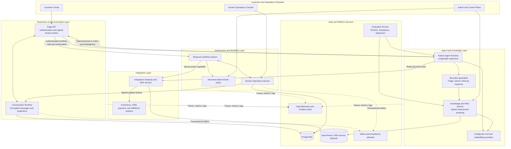
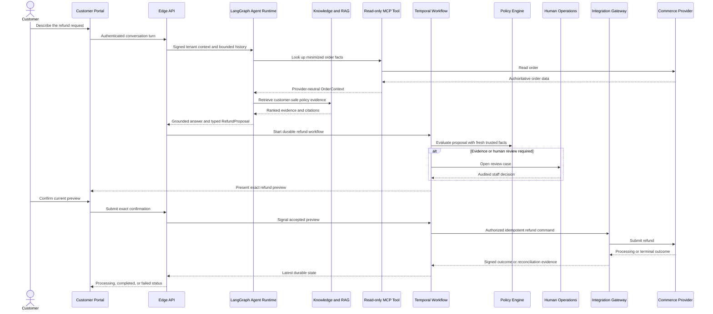

# Customer Service Agent Platform

## Governed customer service agents for retail

Customer Service Agent Platform is a personal engineering project for building,
governing, evaluating, and operating AI customer service agents. It combines
conversational AI with deterministic policy, durable workflows, human review,
retrieval augmented generation, commerce integrations, evaluation, and
observability.

The first end-to-end reference journey is a complex refund workflow. A LangGraph
supervisor coordinates bounded specialists, but the model never receives the
authority to approve or execute a refund. Temporal owns the durable process,
versioned policy determines eligibility, humans review exceptional cases, and an
Integration Gateway controls the final commerce mutation.

## At a glance

- **Supervisor and specialist agents:** LangGraph routes work to bounded refund,
  retrieval, and response specialists.
- **Production-shaped RAG:** versioned knowledge ingestion, hybrid BM25 and vector
  retrieval, metadata filtering, reciprocal rank fusion, cross-encoder reranking,
  and citations.
- **Governed actions:** models return schema-validated proposals; deterministic
  services authorize consequential actions.
- **Durable workflows:** Temporal manages confirmation, human approval, retries,
  provider processing, and reconciliation across restarts.
- **Human operations:** staff can claim cases, review evidence, approve exceptional
  plans, reject requests, and inspect an append-only audit trail.
- **Multi-tenant security:** signed tenant context, audience-scoped assertions,
  least-privilege tools, and isolated knowledge releases.
- **Evaluation and observability:** deterministic graders, RAGAS, repeated trials,
  Tau-bench-style simulations, OpenTelemetry, Prometheus, Tempo, Loki, and Grafana.

## Platform architecture

This view combines the locally exercised refund platform with reusable boundaries
for newer support journeys. Kafka and the AWS services shown below are targets,
not running parts of the local stack.



### Why the boundaries matter

The agent can understand a request, retrieve knowledge, call read-only tools, and
propose a next action. It cannot grant itself permission to mutate a business
system. Trusted services independently verify identity, tenant, current commerce
facts, policy version, customer confirmation, human decisions, and idempotency
before a write crosses the Integration Gateway.

## Governed refund journey



The provider accepting a request does not immediately mean success. The customer
sees **Refund processing** until a signed provider event or authoritative
reconciliation confirms the terminal outcome.

## Human chat handoff

An authenticated customer can request a person from the same support chat.
Conversation Runtime switches control from AI to a staff queue atomically;
customer messages continue to be stored, but no model answers while a
specialist owns the conversation. A separately authenticated support agent
claims the conversation in Operations Console, replies into the encrypted
transcript, and can return control to AI or close it. Control versions fence
in-flight assistant replies, and a refund start accepted before handoff is
reserved with its exact encrypted Temporal input for safe retry. Human chat
does not grant refund approval or payment authority. This path passed a local
backend integration check; browser QA and production authentication remain
separate rollout gates. See [the handoff journey](docs/HUMAN_CHAT_HANDOFF_JOURNEY.md).

## Narrow order cancellation journey

The shared support chat can recognize an explicit cancellation request without
entering the refund graph. It offers a **Review cancellation** action; clicking
it opens a separate Temporal workflow and an exact customer preview. The first
implemented policy is limited to placed, unfulfilled, customer-owned orders
with a zero total and no payment, refund, or fulfillment. Confirmation is
required before Gateway and the guarded Vendure plugin can cancel the order.
The customer sees **Order
cancelled** only after provider state and operation marker agree. Two local
disposable orders were exercised, including an uncertain-outcome recovery and
a clean first-attempt completion. This is not a paid-order or bank-authorization
cancellation. Browser interaction/accessibility QA and production identity
remain pending. See [the cancellation journey](docs/ZERO_TOTAL_CANCELLATION_JOURNEY.md).

## Customer service journey portfolio

The refund workflow is the reference vertical slice. The same conversation,
identity, retrieval, policy, workflow, integration, human-review, evaluation, and
observability foundations support the broader journey portfolio.

The current local implementation also includes read-only product/policy,
named-variant indexed availability, exact catalog-price, order-status,
owned-item, order-total, payment/refund-status, recent-order-reference, and
saved-address answers. A separate delivery-issue flow records reports and
administrative review closure; staffed chat handoff and narrow zero-total
cancellation have their own boundaries. Paid-order cancellation, physical
returns/exchanges, replacement, and wider account changes remain planned.
An authorized dummy-payment cancellation experiment exists behind separate
provider and policy guards, but it is not customer-enabled and is not a
general paid-order cancellation journey.
The table below describes the intended portfolio, not a claim that every row
is operational.

| Journey | Platform behavior |
|---|---|
| Refunds and returns | Eligibility, evidence, refund scope, confirmation, approval, execution, and reconciliation |
| Order status and tracking | Read current fulfillment state, carrier events, expected delivery, and customer-safe updates |
| Cancellation and order changes | Validate fulfillment stage, modification rules, inventory effects, and customer confirmation |
| Damaged, missing, wrong, or delayed delivery | Collect evidence, verify order items, route exceptions, and create replacement or refund plans |
| Exchanges and replacements | Check product eligibility, replacement inventory, price differences, shipping, and approval rules |
| Product and policy questions | Retrieve versioned product, warranty, return, shipping, and care guidance with citations |
| Payment and billing support | Explain payment state, invoices, failed payments, refunds, and provider processing without exposing payment data |
| Account and loyalty support | Handle profile, address, loyalty, subscription, and account-recovery requests through scoped tools |
| Human escalation and takeover | Route sensitive, ambiguous, high-value, or policy-exception cases to the correct staff queue |

## RAG architecture

```mermaid
flowchart LR
    Sources[PDF, DOCX, Markdown, HTML, and database records]
    Registry[Source registry\nclassification and content hash]
    Parse[Structure-aware parsing]
    Chunk[Parent and child chunks\nversioned strategy]
    Embed[OpenAI embeddings]
    Index[Release-scoped OpenSearch index]
    Filter[Mandatory metadata filters]
    Hybrid[BM25 and vector retrieval]
    Fusion[Reciprocal rank fusion]
    Rerank[Cross-encoder reranking]
    Evidence[Citation-ready evidence]

    Sources --> Registry --> Parse --> Chunk --> Embed --> Index
    Index --> Filter --> Hybrid --> Fusion --> Rerank --> Evidence
```



Every indexed chunk carries tenant, environment, knowledge release,
classification, locale, effective dates, document identity, source hash, parser
version, chunking version, and embedding metadata. Customer-facing retrieval is
restricted to `CUSTOMER_SAFE` knowledge before semantic search begins.
DOCX files with top-level tables currently fail ingestion rather than silently
omitting table policy content; [full table support](docs/DOCX_TABLE_INGESTION_BOUNDARY.md)
requires a versioned parser and new immutable knowledge release.

## Evaluation strategy

Evaluation is treated as a software engineering discipline, not a single model
score.

1. **Versioned datasets** cover happy paths, missing facts, tool failures, policy
   boundaries, escalation, adversarial input, and recovery paths.
2. **Deterministic graders** check contracts, tool selection, citations, policy
   compliance, tenant isolation, confirmation, and unsafe action attempts.
3. **RAGAS** measures retrieval precision and recall, faithfulness, answer
   relevance, and factual correctness.
4. **Agent simulations** inspect task completion, trajectory, tool use, handoff,
   and final business state across repeated trials.
5. **Regression evaluation** compares compatible prompt, model, policy, knowledge,
   dataset, and grader versions before a release is promoted.
6. **Human calibration** reviews disagreements between deterministic rules,
   semantic judges, and experienced support operators.

The evaluation tooling and narrow offline regressions exist, but the refund
RAGAS quality gate is still open. A five-case, three-repetition campaign had
no case pass every repetition; a later bounded large-refund diagnostic passed
one blocking check after an earlier guard rejection. LangSmith export,
official Tau-bench execution, human calibration, and full workflow simulations
have not been completed. See the [evaluation status](docs/evaluation/README.md)
before interpreting any score as a release result.

### Provisional Tau-bench-style simulation scorecard

> **Illustrative placeholders:** these values are realistic planning numbers for
> the README layout, not measured results or production claims. They will be
> replaced after the official simulation run and human calibration.

| Metric | Provisional value |
|---|---:|
| Simulated retail conversations | 150 |
| End-to-end task completion | 78% |
| Policy compliance | 96% |
| Correct tool selection | 92% |
| Correct human escalation | 90% |
| Retrieval Recall@5 | 93% |
| Grounded-answer pass rate | 88% |
| Unsafe autonomous refund executions | 0 |

## Technology stack

| Layer | Technology |
|---|---|
| Web applications | Next.js, React, TypeScript |
| APIs and transactional services | Node.js, TypeScript, Fastify |
| Agent orchestration | Python, FastAPI, LangGraph, LangChain |
| Knowledge and retrieval | OpenSearch, BM25, vector search, RRF, cross-encoder reranking |
| Durable workflows | Temporal |
| Agent tools and integrations | Model Context Protocol, Vendure, provider-neutral adapters |
| Persistence | PostgreSQL, encrypted conversation storage, transactional outboxes |
| Asynchronous events | Kafka and Amazon MSK architecture |
| Evaluation | RAGAS, deterministic graders, repeated trials, Tau-bench-style simulations |
| Observability | OpenTelemetry, Prometheus, Tempo, Loki, Grafana, CloudWatch architecture |
| AWS deployment target | Single-region ECS Fargate, RDS, OpenSearch Service, Cognito, S3, Secrets Manager, KMS |

## Repository map

```text
apps/web/                  Customer, operations, and administration interfaces
apps/services/             Edge, conversation, agent, RAG, workflow, gateway,
                           human operations, evaluation, and control services
contracts/                 Canonical cross-language schemas and protocol contracts
packages/                  Shared UI, authentication, telemetry, and policy packages
infrastructure/            Local dependencies, observability, and AWS architecture
tools/simulators/          Local commerce system used for integration testing
docs/                      Architecture, decisions, evaluation, verification, and runbooks
```

## Current reference implementation

The refund journey has been exercised locally from customer conversation through
photo evidence review, supervisor approval, exact customer confirmation, one
idempotent Vendure refund, provider settlement simulation, and completed customer
status. The system also includes customer-safe OpenSearch retrieval, RAGAS
adapters, deterministic agent graders, PostgreSQL-backed Human Operations,
signed multi-tenant context, and local OpenTelemetry dashboards.

Additional local slices answer owned-order status, item, payment-status, and
refund-status questions, plus versioned product/policy questions, without
starting a refund. The payment lookup exposes only owner-checked aggregate
states, not transaction or card details. Three generic exchange questions now
return only the cited conditional **return** rule and explicitly say an
exchange cannot be verified or approved. This is read-only guidance, not a
return or exchange request. A separate delivery-issue flow records a
customer-owned order report; assigned staff can claim, acknowledge, and
administratively close its review. Closure does not establish that the issue
was fixed or that a remedy was given. Claim, acknowledgment, closure,
replay/conflict checks, customer-safe readback, and audit passed a guarded
local backend smoke; browser QA remains pending. Public deployment still
requires production identity, operating procedures, and the release gates in
the [delivery journey notes](docs/DELIVERY_ISSUE_REPORT_JOURNEY.md).

The same support page also has an explicit [saved-address status
check](docs/SAVED_ADDRESS_STATUS_JOURNEY.md). It returns only an address count
and default-address flags for the signed-in customer; it does not disclose
address details or change an account. Customers can separately request a
specialist consultation from the same card; the handoff does not send address
facts or perform an account change.

Customers who do not know an order reference can use the read-only
[recent-order action](docs/RECENT_ORDER_REFERENCES_JOURNEY.md) on that same page.
It lists up to ten latest placed references and dates for the signed-in
customer without using a model or changing an order.
The shared support chat now answers narrowly worded recent-order questions
through the same owner-checked source; it lists references only, not order
status or a complete account history.

For the October 8 precommit checks, see [Codex Handoff](docs/CODEX_HANDOFF.md).
For detailed journey evidence and remaining boundaries, see
[Verification Status](docs/VERIFICATION_STATUS.md).

## Explore the project

- [Documentation map](docs/README.md)
- [Current HLD and LLD](docs/architecture/KLEEM_AI_ARCHITECTURE_V1_1.md)
- [Combined architecture PDF, September 20 snapshot](docs/reference/architecture/Kleem_AI_Combined_HLD_and_LLD_Architecture.pdf)
- [Project context](docs/PROJECT_CONTEXT.md)
- [Evaluation strategy](docs/evaluation/EVALUATION_STRATEGY.md)
- [Evaluation Runner](apps/services/evaluation-runner/README.md)
- [Read-only status evaluation cases](docs/evaluation/READ_ONLY_STATUS_CLARITY_V5.md)
- [Current evaluation status](docs/evaluation/README.md)
- [Observability design and runbook](docs/observability/README.md)
- [Verification evidence](docs/VERIFICATION_STATUS.md)
- [Local refund runbook](docs/LOCAL_REFUND_RUNBOOK.md)
- [Delivery issue report journey](docs/DELIVERY_ISSUE_REPORT_JOURNEY.md)
- [Human chat handoff journey](docs/HUMAN_CHAT_HANDOFF_JOURNEY.md)
- [Read-only support journey boundaries](docs/READ_ONLY_SUPPORT_JOURNEYS.md)
- [Recent-order references](docs/RECENT_ORDER_REFERENCES_JOURNEY.md)
- [Refund photo evidence boundary](docs/REFUND_PHOTO_EVIDENCE.md)
- [Return and exchange discussion boundary](docs/RETURN_EXCHANGE_DISCUSSION.md)
- [Return and exchange offline evaluation](docs/evaluation/RETURN_EXCHANGE_DISCUSSION_V4.md)
- [Saved-address status journey](docs/SAVED_ADDRESS_STATUS_JOURNEY.md)
- [Read-only order total journey](docs/ORDER_TOTAL_JOURNEY.md)
- [Read-only catalog price journey](docs/CATALOG_PRICE_JOURNEY.md)
- [Catalog price offline evaluation](docs/evaluation/READ_ONLY_CATALOG_PRICE_V7.md)
- [Recent-order chat evaluation](docs/evaluation/READ_ONLY_RECENT_ORDERS_V8.md)
- [Zero-total cancellation journey](docs/ZERO_TOTAL_CANCELLATION_JOURNEY.md)
- [Refund execution safety review](docs/REFUND_EXECUTION_SAFETY_2026-10-02.md)
- [Next journey safety boundaries](docs/NEXT_JOURNEY_BOUNDARIES.md)
- [Local authentication and secrets](docs/LOCAL_AUTH_AND_SECRETS.md)
- [Production identity roadmap](docs/PRODUCTION_IDENTITY_ROADMAP.md)
- [AWS deployment readiness](docs/AWS_DEPLOYMENT_READINESS.md)
- [Architecture decision record](docs/adr/ADR-001-polyglot-runtime-and-mcp-boundaries.md)

## Core engineering principle

> Models propose. Deterministic systems authorize. Durable workflows execute.
> Humans remain accountable for exceptional decisions.
